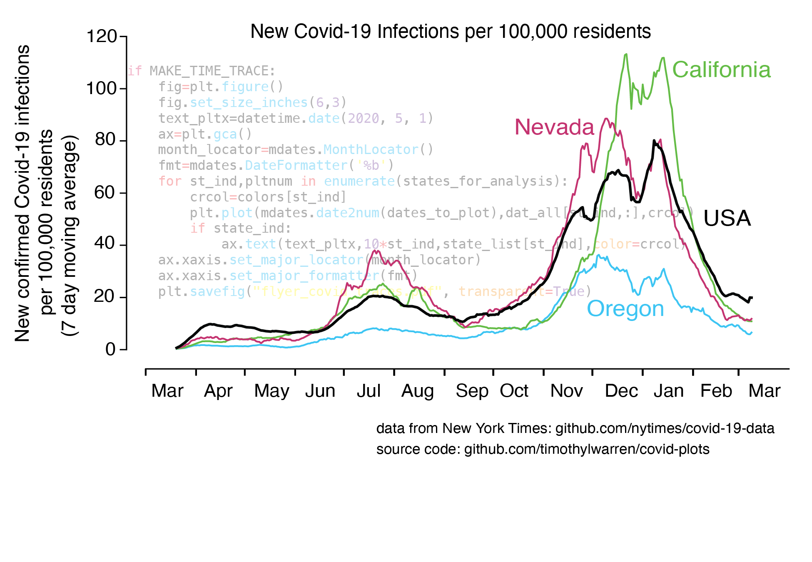

### Course Description
  
 
 
 A new course that focuses on fundamental aspects of data science with specific application to the biological sciences. Through a practical, problem-based approach, students will examine the theory and practice underlying widely used computational methods in biology. They will develop mastery in the analysis and visualization of large data sets using Python, with applications to genomics, ecology, and other areas of biology. Students will test hypotheses, infer dataset parameters, and make predictions via broadly applicable data science tools. The spring 2021 course will have a special focus on datasets related to the Covid-19 pandemic. 

   

### Instructor
      

Timothy Warren  
tim.warren AT oregonstate.edu         

  
  

### [Syllabus](./syllabus.md)

### Weekly Calendar  

|Date                                  | Topic                             |  Relevant Reading                     | Assignment                                 |
|:-----------------------------        |:--------------------------------- |:------------------------------------  |:----------------------                      |
| Week 1  03/30, 04/01&nbsp; &nbsp; &nbsp;&nbsp;&nbsp;| Course Goals and Philosophy  Python on the Jupyter Notebook &nbsp; &nbsp; &nbsp;| [Jupyter Notebook](https://www.e-education.psu.edu/geog489/node/2204)&nbsp; &nbsp; &nbsp;&nbsp; &nbsp;&nbsp; &nbsp; [Unix Shell](https://swcarpentry.github.io/shell-novice/)   [Python Examples](https://nbviewer.jupyter.org/urls/bitbucket.org/hrojas/learn-pandas/raw/master/lessons/Python_101.ipynb) &nbsp; &nbsp;    [Intro to Pandas](http://swcarpentry.github.io/python-novice-gapminder/)   [Pandas Reference](https://pandas.pydata.org/pandas-docs/stable/user_guide/10min.html) [Lecture notes](./lecture_notes/lec_wk01.md)| HW 1   Due Tue 04/06 &nbsp; &nbsp; |
|        |                |         |            |
| Week 2   04/06, 04/08    | Analyzing Tabular Data with Pandas  |[Lecture Notes](./lecture_notes/lec_wk02.md)  [Lists](https://swcarpentry.github.io/python-novice-gapminder/11-lists/index.html) [Numpy arrays   (Inferential Thinking Chap. 5)](https://inferentialthinking.com/chapters/05/Sequences.html) [Loops and Functions in Pandas](https://datacarpentry.org/python-ecology-lesson/06-loops-and-functions/)                                      | HW 2   Due Tue 04/13 |
|     |    |     |      |
| Week 3   04/13, 04/15    | Visualizing Biological Data |[Lecture Notes](./lecture_notes/lec_wk03.md) [matplotlib reference page](https://matplotlib.org/stable/tutorials/index.html#tutorials) 
[Edward Tufte home page](https://www.edwardtufte.com/tufte/)   [Essential Pandas Reference]https://pandas.pydata.org/pandas-docs/stable/user_guide/10min.html)                                                 | HW 3   Due Weds 04/21|
|     |    |     |      |
| Week 4   04/20, 04/22    | Random processes: Description and simulation  |                                                   | HW 4   Due Tue 04/27|
|     |    |     |      |
|  Week 5   04/27, 04/29   | Resampling methods for hypothesis testing   |                                                   | HW 5   Due Tue 05/04|
|     |    |     |      |
| Week 6   05/04, 05/06    | Estimating data set parameters via the bootstrap   |                                                   | HW 6   Due Tue 05/11|
|     |    |     |      |
| Week 7   05/11, 05/13    | Testing and predicting relationships in data:  regression and correlation  |              | HW 7  Due Tue 05/18|
|     |    |     |      |
| Week 8   05/18, 05/20    | Version control and reproducibility with Git |                                                   | HW 8  Due Tue 05/25|
|     |    |     |      |
| Week 9   05/25, 05/27    | Special Topic: Analysis of emerging data from the Covid-19 pandemic|                                                   | HW 9   Due Tue 6/01|
|     |    |     |      |
| Week 10   06/01, 06/03    | Synthesis, Case studies of data science in biology  |                                                   | Final HW  Due Tue 6/08|

